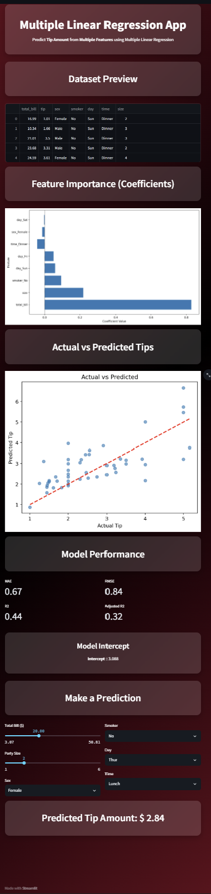

# Multiple Linear Regression App

A Streamlit app to explore and predict restaurant tips using a multiple linear regression model on the `tips` dataset.

## Live Demo

- Deployed app: (Coming soon)

## Preview



## Features
- Loads the classic `tips` dataset and shows a preview.
- Trains a multiple linear regression model using all features (Total Bill, Party Size, Sex, Smoker, Day, Time).
- Displays model metrics (MAE, RMSE, R², Adjusted R²).
- Interactive sliders and dropdowns to predict tip for custom inputs.
- Feature importance visualization showing coefficient values.
- Actual vs Predicted scatter plot.
- Residual plot for model diagnostics.

## Setup
```bash
pip install -r requirements.txt
```

## Run Locally
```bash
streamlit run app_mlr.py
```

## Deploy
You can deploy easily on Streamlit Community Cloud:
1. Push this repo to GitHub (already set up at `origin`).
2. Go to https://share.streamlit.io, connect your repo, choose `app_mlr.py` as the entry point, and deploy.

## Notes
- Ensure your environment has the packages in `requirements.txt`.
- If you rename or relocate the screenshot, update the image path in this README.
